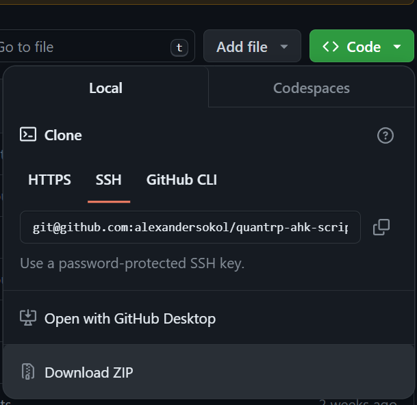
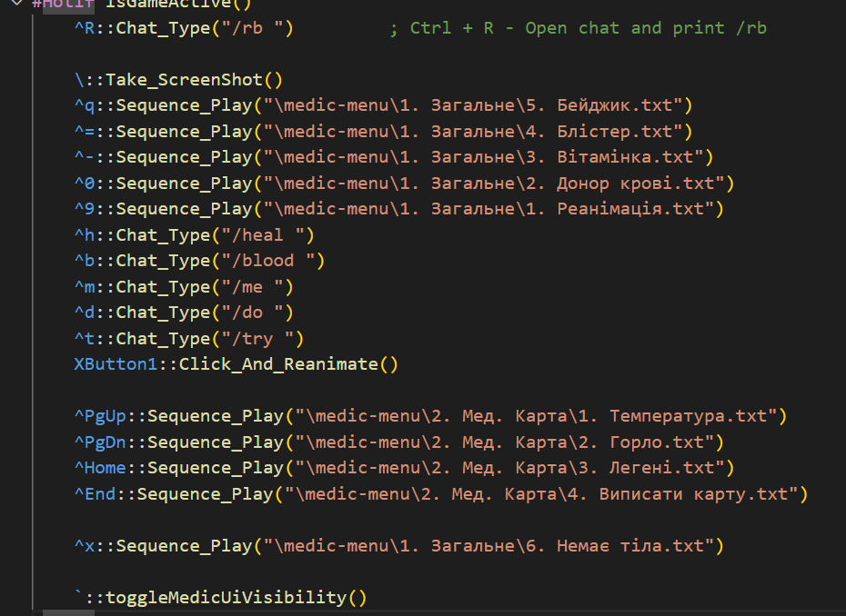
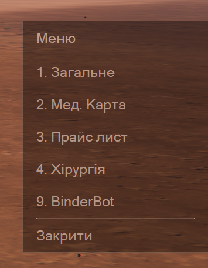
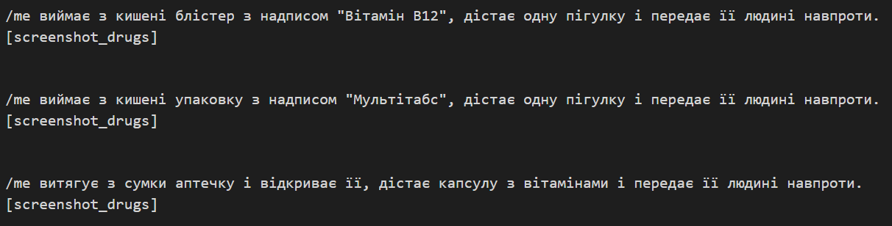

# Quant RP AHK V2 scripts
Даний репозиторій містить в собі збірку корисних скриптів для проекту QuantRP, здебільшого для EMS.

## Можливості
- Скріншоти реанімацій сортуються по відповідним папкам: день/ніч
- Підтримка профілів з BinderBot
- Лекий доступ до всіх відігровок через меню
- Відігровки, це окремі файли, які можна легко редагувати в будь-якому текстовому редакторі
- Відігровки можуть обиратись випадковим чином для однієї ситуації із зазначеного файлу
- Відігровки підтримують тект відповідно до обраної статі
- Підтримка подифікаторів що замінюють текст випадковим чином на вказані значення.
- Підтримка кількох моніторів - скріншоти будуть робитись із того де активна гра
- Скріншоти реанімацій, пігулок, блістерів - сортуються та сладаються у окрему папку відповідно до поточної дати та тижня премій, наприклад "06.04-12.04.2024"
- скріншоти робляться миттєво, без затримки
- "легкі" скріншоти - мають розмір майже в 10 раз менший ніж робить BinderBot при однаковій якості
- не дозволяє випадково ввести тест підчас відправки відігровки в чат
 
## Установка 
## AHK V2
Скачати та встановити AutoHotKey v2 [тут](https://www.autohotkey.com/) або [тут](https://www.autohotkey.com/download/2.0/AutoHotkey_2.0.12_setup.exe)

## Скачати репозиторій
Щоб скачати скрипти вам необхідно натиснути на зелену кнопку "Code" та натиснути на "Download ZIP".

На ваш компьютер скачається zip архів, котрий треба розархівувати у зручне для вас місце.

## Запуск
У розпакованій папці знайти та двічі натиснути на файл medic.ahk.
При першому запуску необхідно буде ввести данні вашого ігрового персонажу.
При необхіднодності змінити данні персонажу можна редагувати файл `preferences.json` у текстовому редакторі або запустити файл `lib/guiMedicSetup.ahk`.

## Використання
основні бінди це:

`~` - меню

`Ctrl + =` - видати блістер

`Ctrl + -` - видати вітамінку

`Ctrl + 0` - донор крові

`Ctrl + 9` - реанімація

`Mouse4` - кнопка та що на миші збоку, клік + реканімація, можна одразу в меню клікати, щоб нічого більше не натискати

`Ctrl + PgUp` - поміряти тепературу для медкарти

`Ctrl + PgDn` - перевірити горло для медкарти

`Ctrl + Home` - послухати легені для медкарти

`Ctrl + End` - виписати медкарту

`Ctrl + X` - бінд когли на реанімації не бачиш тіла

`Ctrl + Q` - показати бейджик

`Ctrl + R` - чат /rb

`Ctrl + M` - чат /me

`Ctrl + T` - /try

`Ctrl + D` - /do

`\` - скріншот

Змінити бінди можна редагуванням файлу medic.ahk. Спец кнопки по типу `Ctrl` позначається спец символами `^`. 
Позначення інших кнопок можна подивтись в документації [тут](https://www.autohotkey.com/docs/v2/Hotkeys.htm)

## Меню біндера
Натиснувши `~` з правого боку екрану відкриється меню, що буде зкомпановано згідно змісту папки `medic-menu`.

### Редагування меню
Як було зазначено вище - меню біндера формується згідно вмісту папки `medic-menu`.
Таким чином файли .txt, _menu.txt, .bb, .json будуть відображені в меню.

### .txt файли
.txt - файли містять в собі послідовність дій, що будуть відтворені біндером.

Будь-яка строчка, окрім **спец. команд** зазначених нижче, буде відіграна в ігровий чат.

Якщо текст має наступний текст - він буде замінений згідно наступних правил:
- `{він|вона}` - буде замінений відповідно обраної статі в налаштуваннях при першому запуску.
- `[1|2|3|нуль]` - буде замінений на одне із вказаних значенть: 1 чи 2 чи 3 чи нуль
- `{year}` - буде замінено на рік у форматі: 2024
- `{day}` - буде замінено на день у форматі: 7
- `{day2}` - буде замінено на день у форматі: 07
- `{month}` - буде замінено на місяць у форматі: 2
- `{month2}` - буде замінено на місяць у форматі: 02
- `{hours}` - буде замінено на годину у форматі: 9
- `{hours2}` - буде замінено на годину у форматі: 09
- `{minutes}` - буде замінено на хвилини у форматі: 2
- `{minutes2}` - буде замінено на хвилини у форматі: 02
- `{seconds}` - буде замінено на секунди у форматі: 2
- `{seconds2}` - буде замінено на секунди у форматі: 02
- `{date}` - буде замінено на поточну дату у форматі: 10.04.2024
- `{time}` - буде замінено на поточний час у форматі: 11:30
- `{datetime}` - буде замінено на поточний час та дату у форматі: 11:30 10.04.2024
- `{random_10}` - буде замінено на випадкове число від 0 до 10
- `{random_100}` - буде замінено на випадкове число від 0 до 100
- `{random_1000}` - буде замінено на випадкове число від 0 до 1000

**Cпец. команди:** (мають бути на окремому рядку)

- `[2000]` - затримка в мілісекундах(тут 2сек)
- `[screenshot]` - зробити скріншот у папку screeshots в папці із біндером
- `[beep]` - програти короткий звук
- `[screenshot_surgeon]` - скріншот у папку із біндером /screenshots/report/<робочий тиждень>/surgeon
- `[screenshot_drugs]` - скріншот у папку із біндером /screenshots/report/<робочий тиждень>/drugs 
- `[screenshot_reanim]` - скріншот у папку із біндером /screenshots/report/<робочий тиждень>/reanimation/<day or night>
- `[screenshot=mydir]` - скріншот у папку із біндером /screenshots/mydir
- `[screenshot=C:/EMS]` - скріншот у папку C:/EMS
- `[blood_analysis_random]` - програти рандомний результат загального аналізу крові
- `[blood_analysis_random]` - програти результат загального аналізу крові, де всі показники у нормі

***Порожні рядки поміж текстом розділяють варіанти що будуть обрані та відіграні випадкоим чино***

Приклад: буде відіграно один із трьох варіантів, що розділені порошніми рядками.

### _menu.txt файли
Зміст `_menu.txt` файлів буде додано як звичайний текст у меню.

### .json та .bb файли
Файли формату, що використовує BinderBot будуть імортовані як окремий пункт меню разом із його вмістом.

## Можливі проблеми
- Можливі конфлікти із деякими програмами, що використовують схожі бінди клавіш
- Можливе залипання `Ctrl` - треба кілька разів натиснути правий та лівий `Ctrl` по черзі для "Відлипання"
- Можливе залипання клавіш руху `WASD` - натиснути кілька разів на клавішу.